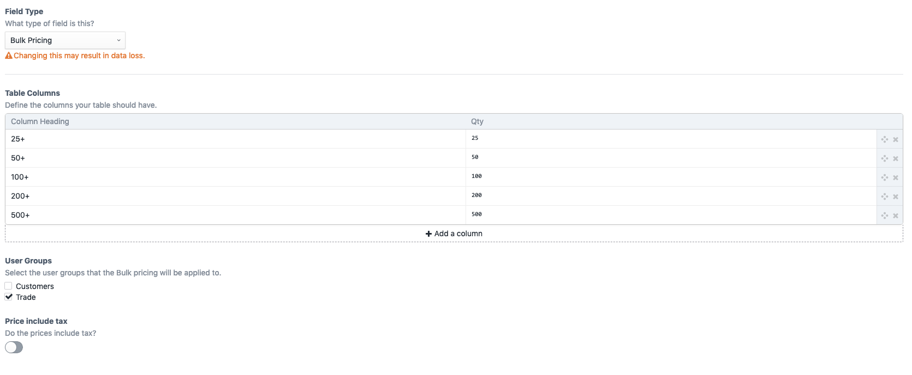
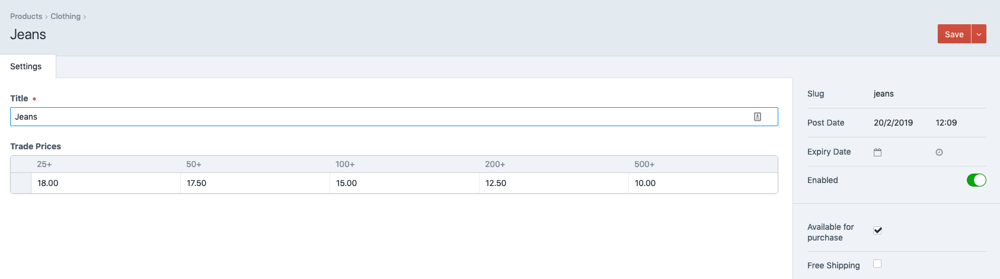
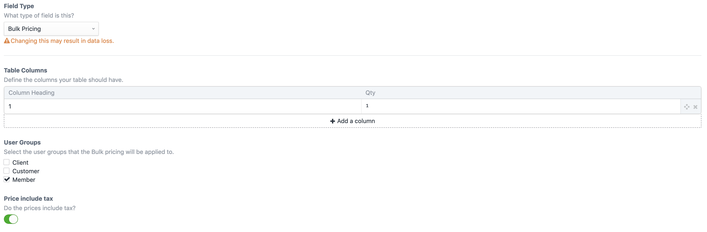
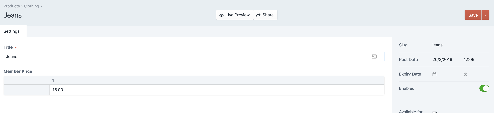

# Commerce Bulk Pricing plugin for Craft CMS 3.x

A Craft fieldtype for setting product prices based on the quantity purchased and/or by user group

## Requirements

This plugin requires Craft CMS 3.0.0-beta.23 or later.

## Installation

To install the plugin, follow these instructions.

1. Open your terminal and go to your Craft project:

        cd /path/to/project

2. Then tell Composer to load the plugin:

        composer require kuriousagency/commerce-bulk-pricing

3. In the Control Panel, go to Settings → Plugins and click the “Install” button for Commerce Bulk Pricing.

## Commerce Bulk Pricing Overview

**Bulk Prices**

Create a Bulk Pricing fieldtype, add your column headers (e.g. 25+, 50+ 100+) and set the required quantity a customer must purchase to receive that price.

There are additional options to restrict the prices to certain user groups and to specify if the prices set include tax.

Add the Bulk Pricing field to a product and set the price for each quantity bracket

**User Group Prices**

The fieldtype can also be used to set a price for certain user groups.

Create a fieldtype with a quantity of 1 - the same price is used regardless of quantity purchased

Set the product price for that user group

Brought to you by [Kurious Agency](https://kurious.agency)
